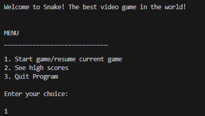
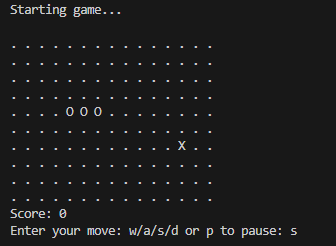
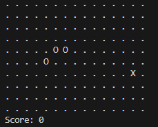
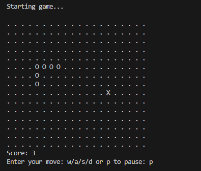
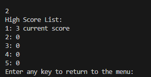
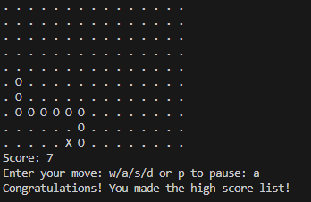
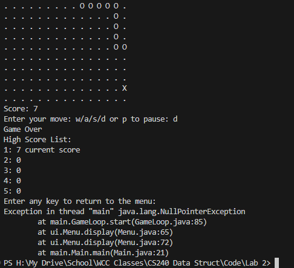

# PROJECT NOTES 
* Use: This file will be used to keep notes of the current state of the project. This will include items such as current state, bugs, and goals for future development. 

## PROJECT OVERVIEW
Our team chose to build the game Snake to practice using linked lists. We started by contributing to a single repo, then after getting the basic framework done, we split to finish the project on our own. Our MVP for this assignment would be to get a rudimentary game to display and play from the console. If we have time, we will use Swing to create a GUI and implement time-based movements. 

[REPO LINK](https://github.com/ajrsabet/Snake_Game)

 
## CURRENT STATE
Here's a quick display of the current state of the game with a description and a list of known bugs or improvements to be made. 

* Welcome and menu display
* All items are functional. The game can be started, paused, and resumed
* Bugs: user input is not validated. It will break if you enter a non-int

    

* The game starts with three snake segments
* You must use w,a,s,d + enter to move
* **bug:** after the first couple of moves, the "head" leaves the snake but then it fixes itself after the thrid move??? I couldn't figure that one out :P

    

* The snake grows one segment every time you eat the food
Another food is randomly spawned

    

    

* The game can be paused and resumed
* The score-board shows the current score 

    

    

* Game over occurs when the snake hits a wall or itself
* **bug:** This was working but the game wasn't resetting itself so a new game would start with the previous snake and food. I am in the process of fixing this bug. 

    

